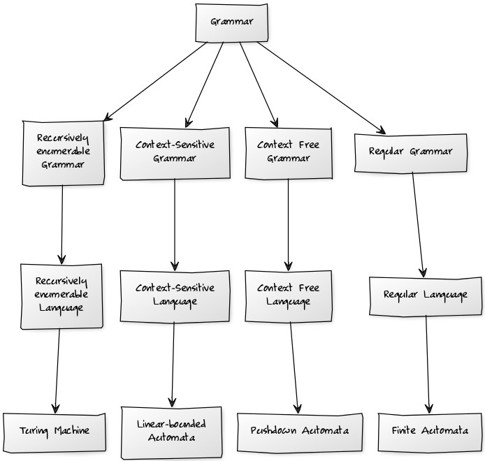
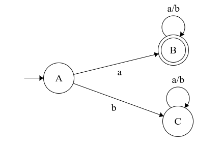
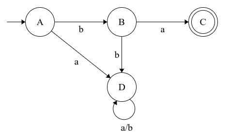
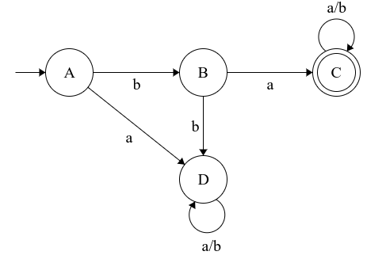
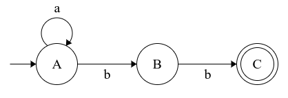
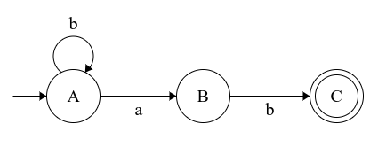
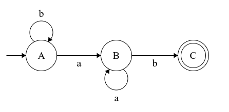
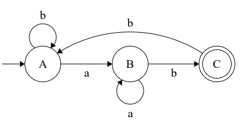
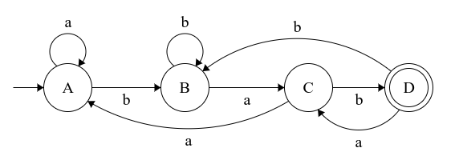

# Theory of Computation
***

### Definition
***
Study of mathematical machine or system, often called automata (deals with computational problem).

### Theory of Formal Languages
***
In mathematics and computer science a formal language is set of **strings** of **symbol** together with a set of rules (**grammar**).

So we need to:
**Grammar** ---(to generate)---> **Language** ---(accepted by)---> **Machine(Automata)**

### Terminology
***
* **Symbol**: Basic building blocks which can be any character as token.

	example: In english alphabet we 26 small (a to z) and 26 capital (A to Z) symbols (letters).

	* English have 26 symbols. More symbols can generate more words, so we can express ourself in a better way.

	* We could have language for say fan with just 2 symbols. One for **ON** and one for **OFF**. It all depends on the complexity of the problem.

	* In formal automata we could have only two symbols like **a** and **b** or say  **0** or **1**.

* **Alphabet**: **Finite non-empty set** of symbols (set of letters).

	example: In english we have {a, b, c, ..., z}

	In formal language we denotes alphabet with **Σ**. So we can have Alphabet with teo symbol, **Σ = {0, 1}** or **Σ = {a, b}**

* **String**: Finite sequence of symbols.

	example: In english **car** is a string. It is already pre-difined and compiled in a dictionary (Oxford Dictionary for example).

* **Language**: Set of a string.

	In Formal language we can have **Language L = {001, 110}** build by **strings 001** and **110** which is built by **alphabet Σ = {0, 1}** which is built from two **symbols 0** and **1**.

### Basic operations on strings
***
Strings are basically denoted by Capital Letter (English), usaually W.

* Length of String: It is denoted by **|W|**.

* Null is a string of length 0 and is denoted by **ϵ**. So |ϵ| = 0.

* Concatenation of strings. 
	Say we have 2 strings **W1 = 'abc'** and **W2 = 'ac'**.
	So concatenation of strings **W1** and **W2** is denoted by **W1.W2 = abcac**.
	* |W1| + |W2| = |W1.W2|
	* W1.W2 ≠ W2.W1 but W.ϵ = ϵ.W = W

* Reverse of a string: It is denoted by **WR**.
	* |W| = |WR|

* Prefix and Sufix: Set of substring of W from starting and ending position respectively.
	Say W = abaa
	Now prefix of W denoted by **P(W)** = {ϵ, a, ab, aba, abaa}
	Sufix of W denoted by **S(W)** = {ϵ, a, aa, baa, abaa}

* Substring: As it sounds. It's a substring. Sequence is maintain
	Say W = abbbaca

	abb -> is a substring
	bab -> is not a substring
	cab -> is not a substring
	bbb -> is a substring

	Say we have a string where all the symbols are unique: **GATE**

	So how many substring we can have?

	| Substring(↓)/Size(→) | 0 | 1 | 2 | 3 | 4 |
	|:-------------:|:-------------:|:-------------:|:-------------:|:-------------:|:-------------:|
	| → | ϵ | G | GA | GAT | GATE |
	| → | - | A | AT | ATE | - |
	| → | - | T | TE | - | - |
	| → | - | E | - | - | - |

	That's equals to 11.

	This can be calculated by **n\*(n+1)/2 + 1**, where |W| = n

### Kleene Closure
***
Denoted by Σ\*. The set Σ\* is the infinite set of all possible strings of all possible lengths over Σ including ϵ.

Let Σ = {a, b}

Now,
Σ0 = {ϵ}

Σ1 = {a, b}

Σ2 = {aa, ab, ba, bb}

:

:

Σk = {W | |W| = k}

:

:

Σ∞ = {W | |W| = ∞}

Union of all these sets is Σ\*.

Also we have,

### Grammar, Language, Automata
***

### Finite Automata
***

### Deterministic Finite Automata
***

DFA = {Q, q0, ∑, F, δ}

Q : Finite set of states.

* It is represented by circle. It is always require to be non-empty.
* We call it finite because we don't use any external memory to remember something. We change state to remember something(symbol).

q0 : Initial state.

* Every finite automata will always have only 1 Initial state.
* It can be named anything apart from q0.
* It have an incoming arrow comming from nowhere.

∑ : set of Input Symbols.

* You require at least 1 symbol. 
* It cannot be infinite.

F : set of Final States.

* A DFA can have more than one final state.
* There can also be a DFA with no Final state. In that case it accept empty langauge.
* Every state can be a Final state. In that case the DFA accept Universal Language.
* It is denoted by double circle.

δ : Transition Function.

It is define as δ: Qx∑->Q

It implies that on some state in set Q if we have some symbol from set ∑, then we transit to some other state present in Q.

Let's take an example.

A DFA which accepts string starting with **a**.

Q = {A, B, C}

q0 = A

∑ = {a, b} 

F = {B}

δ : 
Here we have trasitions:
* For **A** getting **a** we go to **B**.
* For **A** getting **b** we go to **C**.
* For **B** getting **a**, **b** we go to **B**.
* For **C** getting **a**, **b** we go to **C**.

The state diagram of the following is:

DFA -> **For every state for every symbol we must have only one transition.**

We can also draw a transition table:

| State(↓)/Symbols(→) | a | b |
|:-------------:|:-------------:|:-------------:|
| A | B | C |
| B | B | B |
| C | C | C | 

If for any string The machine ends on a finale state then that string is accepted.

You can play arround with this [here](http://madebyevan.com/fsm/).

### DFA Designing
***

* **Design a MDFA over ∑ = {a, b} such that every string accepted must start with W**

	The way to design MDFA starting with a string is:
	* Take the **smallest string possible** and draw the state diagram.
	* After that make the machine **complete**. For every string that is never going to get accepted we have to have a **dead state** for the same.

	1. *W = 'a'*

	The language would be L = {a, aa, ab, aaa, ...}

	Smallest string possible is 'a'. Draw a state diagram which accepts 'a'.

	

	Now complete the machine. We need to have a transition for 'b' from state A. But every string which starts with 'b' should be rejected so Draw a dead state for the same. And for dead state C we keep on looping on recieving 'a' and 'b' as string starts with 'b' should be rejected.

	

	Now we need to have transition for 'a' and 'b' from B. Since after 'a' we can have any number of combination of 'a' and 'b', therefore we can loop on B (Also it's a final state).

	

	2. *W = 'ba'*

	The language would be L = {ba, baa, bab, baaa, ...}

	Smallest string possible is 'ba'. Draw a state diagram which accepts 'ba'.

	

	Now complete the machine. We need to have a transition for 'a' from state A. But every string which starts with 'a' should be rejected so Draw a dead state for the same. ALso we need a transition for 'b' from state B. Now if string starts with 'bb' it should be rejected hence the transition of 'b' from B will be in dead state.

	

	Now to just complete the machine we have transition for 'a' and 'b' from state C (final state) to itself.

	

	3. *W = 'abb'*

	DFA for the language will be:

	

	**NUMBER OF STATES IN DFA STARTING WITH A SUBSTRING OF LENGTH 'n' IS 'n+2'**

	i.e. A DFA starting with substring W where |W| = n,
	number of states = n + 2 

* **Design a MDFA over ∑ = {a, b} such that every string accepted must ends with W**

	The way to design MDFA starting with a string is:
	* Take the **smallest string possible** and draw the state diagram.
	* After that make the machine **complete**. Here we don't have any dead state. All we do is go back or loop in the same state.

	1. *W = 'bb'*

	The language would be L = {bb, abb, bbb, abbb, aabb, ...}

	Smallest string possible is 'bb'. Draw a state diagram which accepts 'bb'.

	

	Now complete the machine. We need to have a transition for 'a' from state A. Now it's possible to have any number of 'a' followed by 'bb'. So we can loop on A (It should be note that A is the state which counts 'bb').

	

	If we have 'a' on B we have to go back to state A since there is a possibility of having 'bb' followed after that.

	

	Again if we have 'b' in C we could just loop at C and if we have 'a' on C we have to go back to A (A counts 'bb'), since there is a possibility of having 'bb' following that. If we have 'b' at C we can just loop in C.

	

	Similarly we can design other DFA.

	2. *W = 'ab'*

	The language would be L = {ab, aab, bab, abab, aaab, ...}

	Smallest string possible is 'ab'. Draw a state diagram which accepts 'ab'.

	

	Now complete the machine. We need to have a transition for 'b' from state A. Now it's possible to have any number of 'b' followed by 'ab'. So we can loop on A (It should be note that A is the state which counts 'ab').

	

	If we have 'a' on B we can loop at B because after that we can transit with one b and have a string which ends with 'ab'.

	

	If we have 'b' on C we have to go back to A since the pattern is destroyed (eg. abb).

	

	Finally if we have 'a' on C we can just go back 1 step i.e. to state B. since then we have a chance of getting 'b', which is followed by the 'a' on C. Therefore that string ends with 'ab'.

	

	3. *W = 'bab'*

	We can similarly draw state diagram for the following language:

	L = {bab, abab, bbab, aabab, ...}

	

	**NUMBER OF STATES IN DFA ENDING WITH A SUBSTRING OF LENGTH 'n' IS 'n+1'**

	i.e. A DFA ending with substring W where |W| = n,
	number of states = n + 1

	This is because in this case we don't require a dead state. 